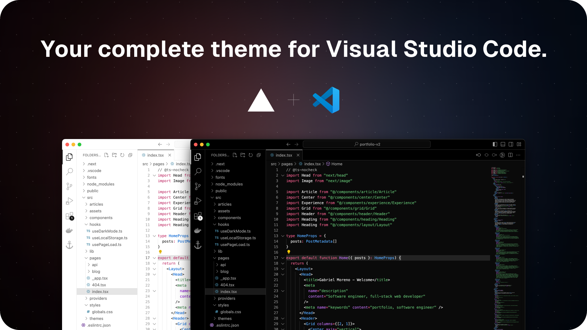

  <a href="https://vercel.com">
    
    <h3 align="center">VSCode Vercel</h3>
  </a>

  Download. Develop. Ship.

# VSCode Vercel

A carefully crafted set of colorschemes that are faithful to [Next.js](https://nextjs.org) & [Vercel](https://vercel.com)'s docs.

  

## License

Licensed under the [MIT](https://opensource.org/licenses/MIT) license.
